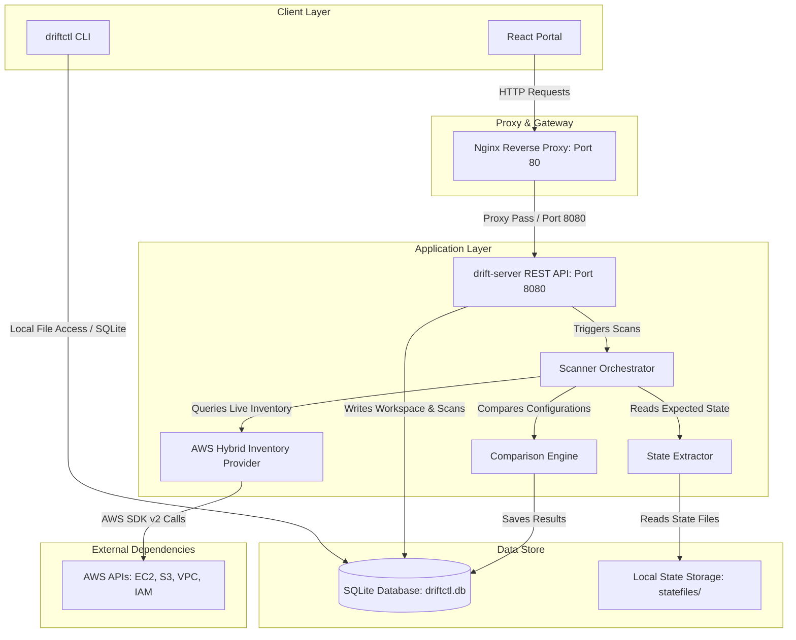

# 🌌 Terraform Drift Detector

A production-grade, DevOps-focused Terraform drift detection engine and interactive dashboard. It scans live cloud environments, compares them against your Terraform state files, and exposes real-time drift reports via a clean REST API, CLI, and modern React portal.

---

## 💡 Problem Statement

Managing cloud infrastructure at scale via Infrastructure as Code (IaC) requires maintaining a perfect synchronization between your codebase and your cloud provider. Unfortunately, several factors break this alignment:
1.  **Manual Tweaks ("ClickOps")**: Developers making emergency hotfixes directly in the AWS Console without reflecting changes in code.
2.  **Resource Deletion**: Untracked manual deletion of managed resources outside of Terraform.
3.  **Tag or Attribute Drift**: Unchecked tag removals or port adjustment configurations.

Without continuous drift monitoring, Terraform states become stale, leading to failed builds, unexpected deletions during plan apply phases, and silent security regressions. This project solves this by continuously auditing resources, normalising complex structural attributes, and displaying exact delta breakdowns.

---

## ✨ Features

-   **Hybrid Inventory Discovery**: Dynamically scans all cloud resources of the same types defined in the Terraform state using official AWS SDK paginators.
-   **Multi-Workspace Isolation**: Separates environments (e.g., Staging, Production) with logical filters, distinct configurations, and region constraints.
-   **Drift Classification**: Detects:
    *   **Missing in Cloud**: Resources defined in code that have been deleted manually.
    *   **Extra in Cloud**: Resources present in the cloud of the audited types but untracked by Terraform.
    *   **Attribute Drift**: Specific property mismatches (e.g., EC2 instance types, VPC DNS settings).
    *   **Tag Drift**: Mismatches between expected and actual resource metadata tags.
-   **Centralized Attribute Normalization**: Sorts complex security group ingress/egress rules deterministically and strips Terraform-specific attributes (`force_destroy`, `lifecycle`) to avoid false positives.
-   **Atomic State Uploads**: Supports versioned multipart file uploads with automatic JSON format parsing and file size limit enforcement (20MB).
-   **REST API & Scheduler**: Includes an HTTP server daemon with built-in cron scanner registration and SQLite results persistence.
-   **Command Line Tool (`driftctl`)**: Provides a full Cobra-based CLI interface to execute scans, register cron schedules, and output reports in console-friendly tables or JSON.
-   **Interactive React UI Portal**: Designed with Tailwind CSS v4, displaying scan logs, workspace status summaries, and side-by-side JSON drift diff viewers.

---

## 🛠️ Tech Stack

*   **Backend**: Go 1.25, Cobra CLI, net/http Mux router
*   **Frontend**: React 19, TypeScript, Vite, Tailwind CSS v4, TanStack Query v5, Axios, Lucide React
*   **Database**: SQLite (utilizing a pure-Go, CGO-free compiler: `modernc.org/sqlite`)
*   **Cloud Integrations**: AWS SDK for Go v2 (EC2, S3, Subnets, VPCs, Security Groups)
*   **DevOps & Containerization**: Docker, Docker Compose
*   **Networking & Proxy**: Nginx 1.27 (Alpine)
*   **CI/CD**: GitHub Actions (Linting, Compose Build tests, Cross-platform Release builds)

---

## 🏗️ Architecture

The application is structured into modular layers designed for performance, isolation, and security.

### System Diagram



### Key Architectural Layers:
1.  **Frontend (UI)**: Bundled and compiled statically. Served by the Go HTTP server from the `web` folder.
2.  **Server Daemon (`drift-server`)**: Handles authentication, cron task registrations, SQLite transactions, and state file uploads.
3.  **State Extractor**: Parses local or versioned `.json` and `.tfstate` files to extract expected resource mappings.
4.  **AWS Hybrid Inventory Provider**: Calls list and describe endpoints. Restricts queries to the resource types present in the state file.
5.  **Comparison Engine**: Calculates deltas by normalising values (e.g. resolving pointers, sorting rule slices, and stripping lifecycle keys) before performing direct maps.

---

## 📂 Project Structure

```
.
├── .github/workflows/         # CI/CD pipelines (ci.yml, docker.yml, release.yml)
├── cmd/
│   ├── drift-server/          # Main entrypoint for Go REST Server
│   └── driftctl/              # Main entrypoint for Cobra CLI
├── configs/                   # Configuration files (driftctl.yaml template)
├── deploy/
│   ├── nginx/                 # Nginx reverse proxy configurations
│   │   ├── nginx.conf         # Global Nginx server settings
│   │   └── conf.d/            # Virtual host definitions
│   ├── terraform/             # AWS provisioning infrastructure Terraform module
│   └── docker-compose.prod.yml # Production Docker Compose setup
├── docker-compose.yml         # Local development Compose configuration
├── Dockerfile                 # Multi-stage image build file
├── frontend/                  # React TypeScript frontend code
├── internal/
│   ├── api/                   # REST controller handlers and middleware
│   ├── config/                # Parser for file and environment configurations
│   ├── drift/                 # Core comparison engine
│   ├── model/                 # Shared domain data structures
│   ├── providers/             # Cloud inventory implementations (AWS SDK integrations)
│   ├── scan/                  # Scanner coordinator orchestration
│   ├── state/                 # Terraform state parser and reader
│   └── store/                 # SQLite storage access functions
├── web/                       # Compiled frontend static assets (served by Server)
└── README.md                  # Project documentation
```

---

## 🔄 How It Works

```
┌─────────────────┐       ┌─────────────────┐       ┌─────────────────┐
│ 1. Create       │       │ 2. Upload State │       │ 3. Fetch Cloud  │
│    Workspace    ├──────►│    Atomically   ├──────►│    Inventory    │
└─────────────────┘       └─────────────────┘       └────────┬────────┘
                                                             │
┌─────────────────┐       ┌─────────────────┐       ┌────────▼────────┐
│ 6. Persist &    │       │ 5. Calculate    │       │ 4. Normalize    │
│    View Results │◄──────┤    Deltas       │◄──────┤    Structures   │
└─────────────────┘       └─────────────────┘       └─────────────────┘
```

1.  **Creating a Workspace**: You register a workspace via the API or CLI, defining the regions to scan, custom ignore tags, and schedules.
2.  **Uploading Terraform State**: The state file is uploaded via a multipart HTTP request. The system validates the file size (max 20MB), verifies that it is valid JSON, and atomically moves it into the versioned storage directory.
3.  **Fetching AWS Resources**: The scanner extracts all managed resource types from the state file. It uses AWS SDK paginators to fetch *all* active resources of those types in the target regions.
4.  **Normalization**: Pointers are safely dereferenced, security group rules are sorted deterministically, and lifecycle variables are stripped to guarantee clean comparisons.
5.  **Drift Comparison**: The engine maps expected attributes from the state against actual values from AWS. Discovered items are grouped into matches, modified properties, missing items, and untracked resources.
6.  **Persisting & Viewing**: The report is saved to SQLite, making the scan history and attribute differences immediately available on the React dashboard.

---

## 🖼️ Screenshots

*Note: The following capture areas show the key layouts of the React interface.*

#### 1. Dashboard Overview

*Displays overall scan success rates, total active workspaces, pending scheduled run counts, and list of recent scan completions.*

#### 2. Workspace Creation

*Allows users to register target scanning regions, exclude patterns, and set cron frequencies.*

#### 3. State File Upload

*Interactive Drag-and-Drop portal with real-time JSON format verification.*

#### 4. Interactive Drift Results

*Side-by-side JSON comparative view showing expected Terraform attributes vs actual AWS attributes.*

#### 5. Scan History Logs

*Full audit log of execution timestamps, counts of unmanaged items, and trend analyses.*

---

## 🌐 API Documentation

All API requests except `/health` and `/static/*` require authentication if `api.api_key` is set in the configuration. Provide it via the `X-API-Key` or `Authorization: Bearer <key>` headers.

| Endpoint | Method | Purpose | Request Body | Response (Success) |
| :--- | :--- | :--- | :--- | :--- |
| `/health` | `GET` | Health Check | None | `{"status": "ok"}` |
| `/api/v1/workspaces` | `GET` | List all workspaces | None | List of Workspace objects |
| `/api/v1/workspaces` | `POST` | Create workspace | Workspace JSON | Created Workspace object |
| `/api/v1/workspaces/{id}` | `GET` | Fetch workspace detail | None | Workspace configuration |
| `/api/v1/workspaces/{id}` | `DELETE` | Delete workspace | None | `204 No Content` |
| `/api/v1/workspaces/{id}/scans` | `POST` | Trigger manual scan | None | Executed Scan Report |
| `/api/v1/workspaces/{id}/scans` | `GET` | List scans of workspace | None (Supports `?limit=N`) | List of Scan logs |
| `/api/v1/scans` | `GET` | List all system scans | None (Supports `?limit=N`) | List of Scan logs |
| `/api/v1/scans/{id}` | `GET` | Fetch detailed scan | None | Scan Report |
| `/api/v1/scans/{id}/report` | `GET` | Fetch report format | None (Supports `?format=json/table`) | Raw Text/JSON report |
| `/api/v1/workspaces/{id}/schedules` | `PUT` | Add/Update cron scan | `{"cron": "* * * * *"}` | Mapped schedule response |
| `/api/v1/workspaces/{id}/schedules` | `DELETE` | Remove cron scan | None | `204 No Content` |
| `/api/v1/workspaces/{id}/state` | `POST` | Upload state file | `multipart/form-data` with `state` file | `{"workspace_id": "...", "uploaded_at": "...", "status": "success"}` |

---

## 💻 CLI Usage

The compiled `driftctl` binary allows running and managing configurations directly from the terminal.

```bash
# General help
driftctl --help

# 1. Trigger an ad-hoc scan against a local state file
driftctl scan --state ./terraform.tfstate --provider aws --region us-east-1

# 2. Trigger an ad-hoc scan against an S3 state file
driftctl scan --state-bucket my-tf-bucket --state-key prod/terraform.tfstate --state-region us-east-1

# 3. Trigger a scan for an existing saved workspace
driftctl scan --workspace prod --output table

# 4. View a stored historical report
driftctl report <scan-id> --output json

# 5. List all registered workspaces
driftctl workspace list

# 6. Add/Update a scan schedule for a workspace
driftctl schedule create --workspace prod --cron "0 */12 * * *"
```

---

## ⚙️ Installation

### Prerequisites
*   Go 1.25 or later installed.
*   Node.js 22 and npm installed.
*   AWS CLI configured with credentials (if auditing live infrastructure).

### Local Development Setup

#### 1. Clone & Setup Backend
```bash
# Clone the repository
git clone https://github.com/DevanshTyagi04/terraform-drift-detector.git
cd terraform-drift-detector

# Download Go modules
go mod download

# Build backend binaries
go build -v -o bin/driftctl ./cmd/driftctl
go build -v -o bin/drift-server ./cmd/drift-server
```

#### 2. Setup React UI
```bash
# Enter frontend folder
cd frontend

# Install package dependencies
npm install

# Start local development server (proxies API requests to http://localhost:8080)
npm run dev
```

#### 3. Start Server locally
```bash
# Run server from root directory
./bin/drift-server --config configs/driftctl.yaml
```

---

## 🚢 Production Deployment

For production deployments, the application should be deployed on a secure host (e.g., AWS EC2) behind an Nginx reverse proxy.

```
                    Internet Traffic (HTTP Port 80 / 443)
                                      ↓
                 ┌────────────────────────────────────────┐
                 │       Nginx Proxy (Docker Container)   │
                 └───────────────────┬────────────────────┘
                                     │
                       Internal Bridge Network
                                     │
                 ┌───────────────────▼────────────────────┐
                 │  drift-detector App (Docker Container) │
                 └────────────────────────────────────────┘
```

### Steps for Deployment

#### 1. Setup Docker Container Registry (GHCR) Image
Instead of building images on your server, pull the pre-built target package from GitHub Container Registry:
```bash
docker pull ghcr.io/devanshtyagi04/terraform-drift-detector:latest
```

#### 2. Run with Docker Compose Production
Deploy the preconfigured production stack containing both the isolated app container and the Nginx reverse proxy:
```bash
# Navigate to deployment directory
cd deploy

# Start services
docker compose -f docker-compose.prod.yml up -d
```

#### 3. Configuration with DuckDNS and Let's Encrypt SSL
To expose the dashboard securely with SSL:
1.  **DuckDNS Configuration**: Map your EC2 public IP to a free DuckDNS subdomain (e.g. `my-drift.duckdns.org`).
2.  **SSL via Certbot**: 
    Install Certbot on your EC2 host and generate Let's Encrypt certificates:
    ```bash
    sudo certbot certonly --standalone -d my-drift.duckdns.org
    ```
3.  **Mount Certificate**: Update `deploy/docker-compose.prod.yml` to mount the certificate files and bind Nginx to port `443`. Update the Nginx configurations to enforce secure HTTPS redirection.

---

## 🔧 Configuration

### 1. File Configuration (`driftctl.yaml`)
Global default properties are stored inside `configs/driftctl.yaml`.
```yaml
database: driftctl.db        # Location of the SQLite storage
api:
  addr: ":8080"              # Server listen port
  api_key: "change-in-prod"  # Restricts API access
```

### 2. Environment Variables

| Variable | Description |
| :--- | :--- |
| `DRIFTCTL_DB_PATH` | Overrides the default SQLite database path (e.g., `/data/driftctl.db`). |
| `AWS_ACCESS_KEY_ID` | Standard AWS credentials key (automatically read on local hosts). |
| `AWS_SECRET_ACCESS_KEY` | Standard AWS credentials secret. |
| `AWS_REGION` / `AWS_DEFAULT_REGION` | Target AWS scanning region. |

---

## 🔒 Security

*   **Non-Root Isolation**: The production Dockerfile compiles binaries statically (`CGO_ENABLED=0`) and runs the Alpine execution layer as an unprivileged, isolated user: `driftctl`.
*   **Permissions Minimization**: The AWS provisioning Terraform module (`deploy/terraform/`) enforces least privilege policies. It attaches a read-only role (`TerraformDriftDetectorRole`) restricting actions to VPC, Subnet, EC2, and S3 inventory APIs.
*   **Security Headers**: Nginx is configured to inject security protection headers:
    *   `X-Frame-Options: SAMEORIGIN`
    *   `X-Content-Type-Options: nosniff`
    *   `Referrer-Policy: no-referrer-when-downgrade`
    *   `Content-Security-Policy`

---

## ⚠️ Limitations

*   **AWS Resource Coverage**: Only audits VPCs, Subnets, EC2 Instances, S3 Buckets, and Security Groups. Other resource types in your state files are ignored.
*   **No PUT Workspace API**: The REST API does not support workspace updates (`PUT /api/v1/workspaces/{id}`). Users must delete and recreate workspaces to edit settings.

---

## 🔮 Future Improvements (Not Yet Implemented)

The following areas are identified as future improvements for the project:
*   [ ] **CI/CD EC2 Automatic Deployment**: GitHub Actions pipeline to automatically deploy Docker containers to AWS EC2 on main pushes.
*   [ ] **User Authentication & RBAC**: Integration with OAuth2/OIDC providers (e.g. Keycloak, Auth0) to manage user logins and permissions.
*   [ ] **Multi-Cloud Integrations**: Support for Microsoft Azure and Google Cloud Platform (GCP) resources.
*   [ ] **PostgreSQL Migration**: Support database backends other than SQLite to handle large numbers of scans.
*   [ ] **Real-time Notifications**: Trigger webhooks to alert Slack channels or Microsoft Teams when drift is detected.
*   [ ] **Prometheus/Grafana Dashboard**: Expose `/metrics` for scraping scan results and graphing drift counts.
*   [ ] **Cost Estimation Mappings**: Integration with tools like Infracost to estimate the cost of drifted resources.
*   [ ] **Historical Drift Analytics**: Visualizing drift metrics over time to identify frequent manual changes.

---

## 🤝 Contributing

Contributions are welcome! Please follow these steps to contribute:
1.  Fork the Repository.
2.  Create your Feature Branch (`git checkout -b feature/AmazingFeature`).
3.  Commit your Changes (`git commit -m 'Add some AmazingFeature'`).
4.  Push to the Branch (`git push origin feature/AmazingFeature`).
5.  Open a Pull Request.

---

## 📄 License

This project is licensed under the MIT License - see the [LICENSE](LICENSE) file for details.

---

## 💖 Acknowledgements

*   [Terraform](https://github.com/hashicorp/terraform) for providing standard state schemas.
*   The pure-Go SQLite team for [modernc.org/sqlite](https://modernc.org/sqlite).
*   The [Vite](https://vitejs.dev/) and [React](https://react.dev/) teams.