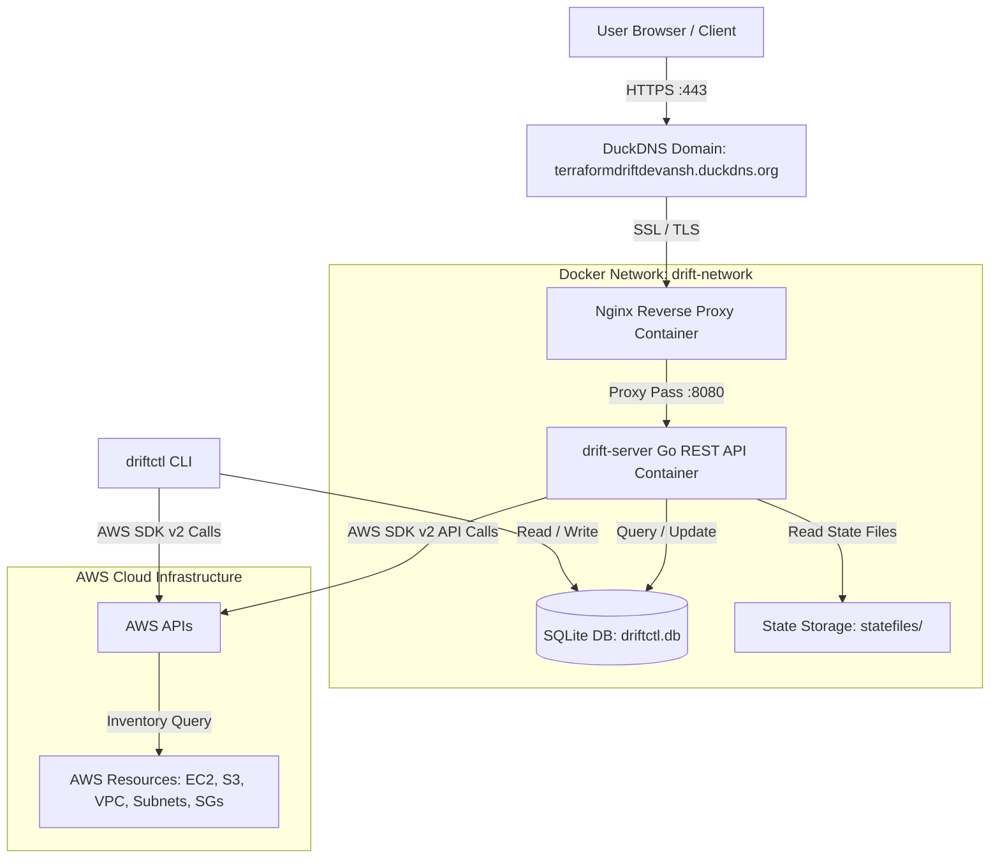
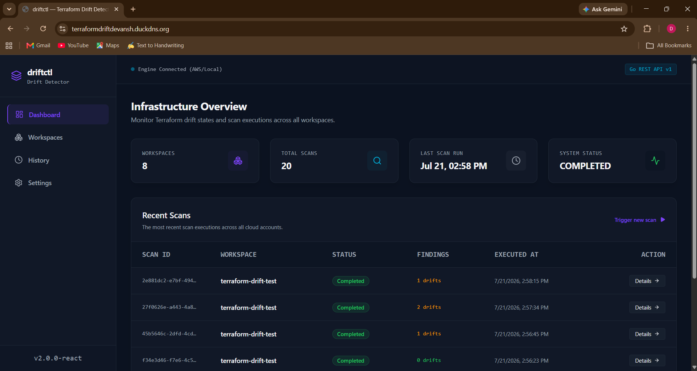
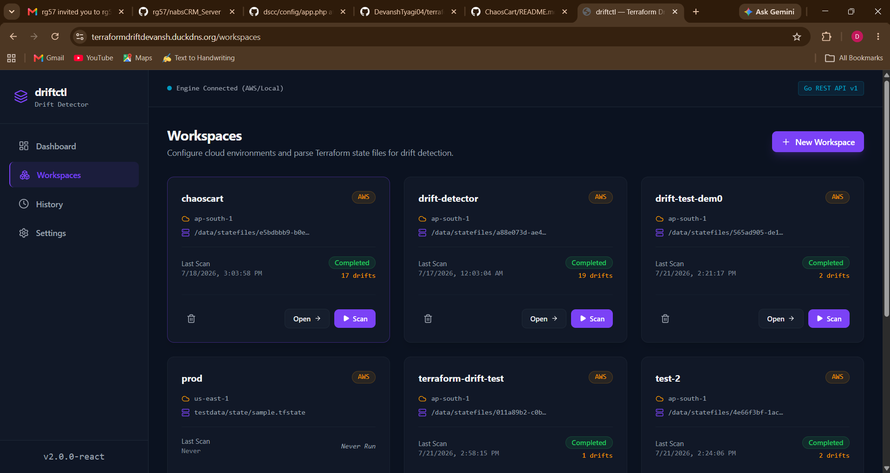
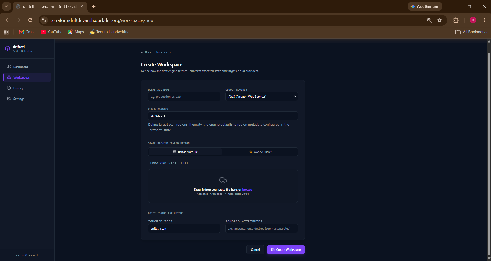
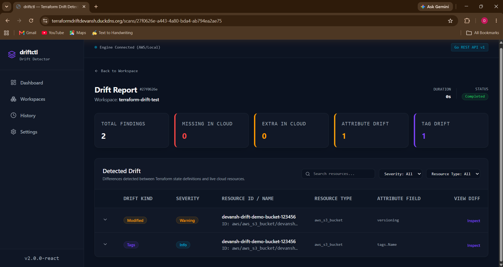
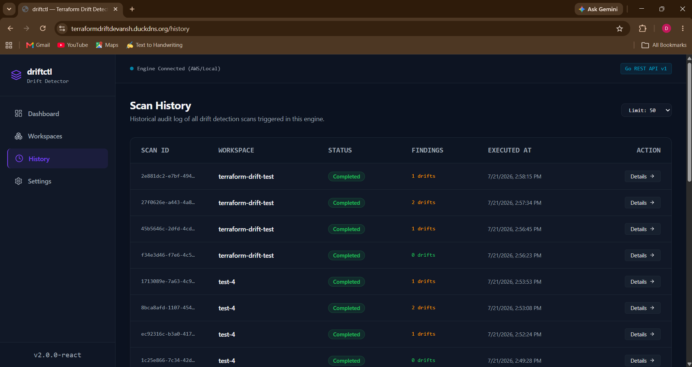

# Terraform Drift Detector


A web application and CLI tool that detects configuration drift between Terraform state files and live AWS cloud resources. It extracts managed resources from state files, inventories active cloud resources using AWS SDK paginators, normalizes complex attributes, and highlights resource mismatches in a web dashboard and command-line interface.

---

## 🌐 Live Demo

- **Application URL**: [https://terraformdriftdevansh.duckdns.org](https://terraformdriftdevansh.duckdns.org)

The live instance is deployed on an AWS EC2 instance using Docker Compose and an Nginx reverse proxy configured with Let's Encrypt SSL and automatic HTTP-to-HTTPS redirection.

---

## 🎥 Demo

### Quick Demo

> Upload a Terraform state file, scan your AWS infrastructure, and detect configuration drift in seconds.


### Full Walkthrough

A complete walkthrough demonstrating:

- Creating a workspace
- Uploading a Terraform state file
- Running a drift scan
- Viewing scan results
- Introducing infrastructure drift in AWS
- Detecting and inspecting the resulting drift

📺 **Watch the full demo:** https://youtu.be/C5y9Ur2Y8zM

---

## 🎯 Why I Built This

I built this project to gain a deep technical understanding of infrastructure drift management by constructing a complete drift detection engine from scratch.

Developing this system required designing a pipeline that handles Terraform state parsing, queries live cloud infrastructure via AWS SDK paginators, normalizes non-deterministic attributes (such as unordered security group rules), exposes a REST API and CLI, and serves an integrated frontend behind a secure reverse proxy.

---

## 📋 Problem Statement

Infrastructure drift occurs when the actual state of cloud resources diverges from the expected state defined in Infrastructure as Code (IaC) files. This usually happens due to manual modifications made in the cloud console ("ClickOps"), out-of-band updates, or emergency hotfixes that are not committed back to Terraform.

Unmanaged drift leads to stale Terraform state files, unexpected resource replacements during subsequent `terraform apply` runs, and undetected security policy violations.

This project addresses the problem by parsing Terraform state files, discovering corresponding live AWS resources, normalizing complex attributes, and identifying missing, extra, or modified resources.

---

## ✨ Features

- **Workspace-based scanning**: Isolate environments (e.g., production, staging) with specific state files, target regions, and ignore rules.
- **Terraform state upload**: Upload `.tfstate` or `.json` files (up to 20MB) via drag-and-drop or API with atomic disk writes.
- **AWS inventory discovery**: Fetch all cloud resources of managed types using official AWS SDK paginators.
- **Attribute drift detection**: Compare expected vs. actual attributes (instance types, VPC DNS settings, etc.).
- **Tag drift detection**: Identify added, removed, or modified resource metadata tags.
- **Structural rule normalization**: Sort security group rules and dereference pointer types to eliminate false positives.
- **REST API**: Manage workspaces, trigger scans, upload state files, and fetch JSON reports over HTTP/HTTPS.
- **CLI tool (`driftctl`)**: Execute ad-hoc or workspace scans, list stored results, and manage schedules from the terminal.
- **React dashboard**: View scan history, workspace statuses, and side-by-side JSON diffs.
- **SQLite persistence**: Store workspace metadata and historical scan results in a single database file.
- **HTTPS deployment**: Pre-configured Nginx reverse proxy setup with SSL termination and security headers.

---

## 🛠️ Tech Stack

- **Backend**: Go 1.25, Cobra CLI, `net/http` standard library router
- **Frontend**: React 19, TypeScript, Vite, Tailwind CSS v4, TanStack Query v5, Axios, Lucide React
- **Database**: SQLite (via pure-Go `modernc.org/sqlite` driver, no CGO dependency)
- **Cloud**: AWS (EC2, S3, Subnets, VPCs, Security Groups) via AWS SDK for Go v2
- **DevOps**: Docker, Docker Compose, GitHub Actions (CI, Docker verification, release builds)
- **Infrastructure**: Terraform (AWS EC2 provisioning module under `deploy/terraform/`)
- **Containerization**: Multi-stage Dockerfile (`node:22-alpine` builder, `golang:1.25-alpine` builder, `alpine:3.21` runtime)
- **Networking**: Nginx 1.27 (Alpine) reverse proxy with gzip compression, WebSocket support, and static asset caching

---

## 🏗️ Architecture

### Production Architecture Diagram



### Architectural Overview

1. **Client & Ingress**: HTTPS traffic arrives at Nginx on port 443. Nginx terminates SSL, applies security headers, handles static asset caching (`/static/`), and proxies requests to `drift-server` on port 8080 over an internal Docker bridge network (`drift-network`).
2. **Backend Daemon (`drift-server`)**: Serves the compiled React frontend, handles REST API calls, manages workspace states, and triggers background scan executions.
3. **State Reader**: Extracts expected resource states from uploaded `.tfstate` or `.json` files.
4. **AWS Provider**: Inspects resource types present in the state file and inventories all active cloud resources of those types using AWS SDK paginators.
5. **Comparison Engine**: Normalizes attributes (dereferencing pointers, sorting security group ingress/egress rules, stripping lifecycle keys) and compares expected vs. actual states.
6. **Persistence**: Scan reports and workspace configurations are persisted in SQLite.

---

## 📂 Project Structure

```
.
├── .github/workflows/         # GitHub Actions workflows (ci.yml, docker.yml, release.yml)
├── cmd/
│   ├── drift-server/          # Entry point for the REST API server daemon
│   └── driftctl/              # Entry point for the Cobra CLI tool
├── configs/                   # Configuration files (driftctl.yaml)
├── deploy/
│   ├── nginx/                 # Nginx reverse proxy configurations
│   │   ├── nginx.conf         # Global Nginx settings
│   │   └── conf.d/            # Virtual host configurations
│   ├── terraform/             # AWS EC2 infrastructure provisioning module
│   └── docker-compose.prod.yml # Production Docker Compose configuration
├── docs/                      # Documentation
│   ├── API.md                 # Detailed REST API reference
│   └── CLI.md                 # Detailed CLI command reference
├── docker-compose.yml         # Development Docker Compose file
├── Dockerfile                 # Multi-stage Docker image build specification
├── frontend/                  # React TypeScript frontend source code
├── internal/
│   ├── api/                   # REST API routes and handlers
│   ├── config/                # Configuration file and environment variable parser
│   ├── drift/                 # Core comparison engine
│   ├── model/                 # Shared data models
│   ├── providers/             # Cloud inventory implementations (AWS SDK integrations)
│   ├── scan/                  # Scanner orchestrator
│   ├── state/                 # Terraform state parser and reader
│   └── store/                 # SQLite storage implementation
├── web/                       # Compiled frontend static assets (served by Go server)
└── README.md                  # Project overview and documentation
```

---

## 🔄 How It Works

```
┌──────────────────┐      ┌──────────────────┐      ┌──────────────────┐
│ 1. Create        ├─────►│ 2. Upload State  ├─────►│ 3. Fetch Cloud   │
│    Workspace     │      │    File          │      │    Resources     │
└──────────────────┘      └──────────────────┘      └────────┬─────────┘
                                                             │
┌──────────────────┐      ┌──────────────────┐      ┌────────▼─────────┐
│ 6. Persist &     │◄─────┤ 5. Execute Drift │◄─────┤ 4. Normalize     │
│    View Findings │      │    Comparison    │      │    Attributes    │
└──────────────────┘      └──────────────────┘      └──────────────────┘
```

1. **Workspace Creation**: A workspace is registered via the web UI, API, or CLI, specifying target AWS regions and tag ignore filters.
2. **State Upload**: The Terraform state file is uploaded via HTTP multipart form or saved locally. The file is validated for JSON format syntax and stored.
3. **Cloud Inventory Fetching**: The scanner identifies resource types in the state file and fetches all live AWS resources of those types using SDK paginators.
4. **Attribute Normalization**: Pointers are dereferenced, lists (e.g., security group rules) are sorted deterministically, and Terraform lifecycle attributes are stripped.
5. **Drift Comparison**: The engine compares expected state values against actual AWS values and categorizes resources into: matched, modified (attribute/tag drift), missing in cloud, or extra in cloud.
6. **Persistence & Viewing**: Results are stored in SQLite and displayed in the React dashboard or terminal.

---

## 🖼️ Screenshots

#### 1. Dashboard Overview

*Workspace summary metrics, recent scan history, and status breakdown.*

#### 2. Workspace Creation

*All the workspaces.*

#### 3. State File Upload

*Drag-and-drop state file uploader with JSON validation.*

#### 4. Drift Results

*Side-by-side comparative diff of expected Terraform attributes vs. actual AWS configurations.*

#### 5. Scan History

*Historical execution log and unmanaged resource tracking.*

---

## 🌐 API Overview

For detailed request/response examples and authentication details, see the [API Reference Documentation](docs/API.md).

| Endpoint | Method | Purpose |
| :--- | :--- | :--- |
| `/health` | `GET` | Server health check (unauthenticated) |
| `/api/v1/workspaces` | `GET` | List all workspaces |
| `/api/v1/workspaces` | `POST` | Create a workspace |
| `/api/v1/workspaces/{id}` | `GET` | Get workspace details |
| `/api/v1/workspaces/{id}` | `DELETE` | Delete a workspace |
| `/api/v1/workspaces/{id}/state` | `POST` | Upload state file for a workspace |
| `/api/v1/workspaces/{id}/scans` | `POST` | Trigger a manual drift scan |
| `/api/v1/workspaces/{id}/scans` | `GET` | List scans for a workspace |
| `/api/v1/scans` | `GET` | List all scans |
| `/api/v1/scans/{id}` | `GET` | Get detailed scan report |
| `/api/v1/scans/{id}/report` | `GET` | Get formatted report (`json` or `table`) |
| `/api/v1/workspaces/{id}/schedules` | `PUT` | Upsert cron schedule |
| `/api/v1/workspaces/{id}/schedules` | `DELETE` | Remove cron schedule |

---

## 💻 CLI Usage

For complete flag options and advanced subcommands, see the [CLI Reference Documentation](docs/CLI.md).

```bash
# Scan using a local state file
driftctl scan --state ./terraform.tfstate --provider aws --region us-east-1

# Scan using an S3 backend state file
driftctl scan --state-bucket my-tf-state --state-key prod/terraform.tfstate --state-region us-east-1

# Scan a saved workspace
driftctl scan --workspace production --output table

# Display a past scan report
driftctl report <scan-id> --output json

# List workspaces
driftctl workspace list

# Create a scan schedule
driftctl schedule create --workspace production --cron "0 */6 * * *"
```

---

## 🚀 Installation

### Option 1: Using Docker Compose (Recommended)

```bash
# Clone the repository
git clone https://github.com/DevanshTyagi04/terraform-drift-detector.git
cd terraform-drift-detector

# Start the application using Docker Compose
docker compose up -d
```

The application will be available at `http://localhost:8080`.

### Option 2: Local Development Setup

#### Prerequisites
- Go 1.25+
- Node.js 22+ & npm
- AWS CLI configured with read credentials

#### Steps

1. **Build the Frontend**:
   ```bash
   cd frontend
   npm install
   npm run build
   cd ..
   ```

2. **Build and Run the Go Backend Server**:
   ```bash
   go build -o bin/drift-server ./cmd/drift-server
   ./bin/drift-server --config configs/driftctl.yaml
   ```

3. **Build the CLI**:
   ```bash
   go build -o bin/driftctl ./cmd/driftctl
   ./bin/driftctl --help
   ```

---

## 🚢 Production Deployment

The production deployment uses the following stack:
- **AWS EC2**: Hosts the single-instance server.
- **Docker Compose**: Orchestrates the Nginx reverse proxy and application containers.
- **GitHub Container Registry (GHCR)**: Stores pre-built Docker images (`ghcr.io/devanshtyagi04/terraform-drift-detector`).
- **Nginx Reverse Proxy**: Listens on port 80/443, handles SSL termination, and proxies to the application container on port 8080.
- **DuckDNS**: Provides dynamic DNS resolution (`terraformdriftdevansh.duckdns.org`).
- **Let's Encrypt**: Issues SSL certificates via Certbot.
- **HTTPS Redirection**: Nginx automatically redirects HTTP traffic (port 80) to HTTPS (port 443).

### Deployment Commands

```bash
# Pull the production Docker image from GHCR
docker pull ghcr.io/devanshtyagi04/terraform-drift-detector:edge

# Start production services from the deploy directory
cd deploy
docker compose -f docker-compose.prod.yml up -d
```

---

## 🔧 Configuration

### `configs/driftctl.yaml`
```yaml
database: driftctl.db
api:
  addr: ":8080"
  # api_key: "your-api-key"
```

### Environment Variables

| Variable | Purpose |
| :--- | :--- |
| `DRIFTCTL_DB_PATH` | Path to the SQLite database file (e.g., `/data/driftctl.db`). |
| `AWS_ACCESS_KEY_ID` | AWS access key credential. |
| `AWS_SECRET_ACCESS_KEY` | AWS secret access key credential. |
| `AWS_SESSION_TOKEN` | AWS session token (for temporary credentials). |
| `AWS_DEFAULT_REGION` / `AWS_REGION` | Target AWS scanning region. |

---

## 🔐 Security

- **Unprivileged Container Execution**: The Docker container runs as a non-root `driftctl` user.
- **Least-Privilege IAM Role**: The AWS Terraform module (`deploy/terraform/`) provisions an IAM role (`TerraformDriftDetectorRole`) restricted to read-only `Describe*` and `List*` operations.
- **HTTP Security Headers**: Nginx injects `X-Frame-Options: SAMEORIGIN`, `X-Content-Type-Options: nosniff`, `Referrer-Policy: no-referrer-when-downgrade`, and `Content-Security-Policy`.
- **API Key Authorization**: Optional `X-API-Key` or `Authorization: Bearer` middleware enforcement for REST endpoints.

---

## ⚠️ Limitations

- **AWS Resource Support**: Currently supports EC2 Instances, S3 Buckets, Subnets, VPCs, and Security Groups. Other resource types present in state files are ignored during cloud inventory fetches.
- **Workspace Editing**: The REST API does not currently expose a `PUT /api/v1/workspaces/{id}` endpoint. Workspaces must be deleted and recreated to change parameters.

---

## 🔮 Future Improvements

The following features are planned for future releases:
- [ ] **Automated EC2 Deployment**: GitHub Actions workflow to auto-deploy updated images to EC2 on `main` branch pushes.
- [ ] **Authentication & RBAC**: User login management with OIDC/OAuth2 providers.
- [ ] **Multi-Cloud Support**: Resource auditing for Azure and GCP.
- [ ] **PostgreSQL Migration**: Support for external PostgreSQL databases for large-scale scan storage.
- [ ] **Scheduled Background Scans**: Native background worker execution for registered cron schedules.
- [ ] **Notifications**: Webhook integration for Slack, Microsoft Teams, and email alerts when drift occurs.
- [ ] **Prometheus Metrics**: `/metrics` endpoint for Grafana visual dashboards.
- [ ] **Cost Estimation**: Integration with Infracost to calculate monetary impact of drifted resources.
- [ ] **Historical Analytics**: Long-term trend analysis of drift frequency per environment.

---

## 🤝 Contributing

Contributions are welcome. Please follow these steps:
1. Fork the repository.
2. Create a feature branch (`git checkout -b feature/your-feature`).
3. Commit your changes (`git commit -m 'Add your feature'`).
4. Push to the branch (`git push origin feature/your-feature`).
5. Open a Pull Request.

---

## 📄 License

This project is licensed under the MIT License. See the [LICENSE](LICENSE) file for details.

---

## 💖 Acknowledgements

- [HashiCorp Terraform](https://github.com/hashicorp/terraform)
- [AWS SDK for Go v2](https://github.com/aws/aws-sdk-go-v2)
- [pure-Go SQLite driver (`modernc.org/sqlite`)](https://modernc.org/sqlite)